# 🔐 AWS IAM Role-Based Access Control (RBAC) Implementation

## 📌 Project Overview

This project demonstrates the implementation of Role-Based Access Control (RBAC) using AWS Identity and Access Management (IAM).

The architecture simulates a real-world enterprise environment where different teams require different levels of access to AWS services based on their responsibilities.

The project follows security best practices such as:
- Least Privilege Access
- Department-Based Access Control
- IAM Groups & Custom Policies
- Restricted Administrative Access
- Monitoring-Only Security Access

---

# 🏗️ Architecture Diagram

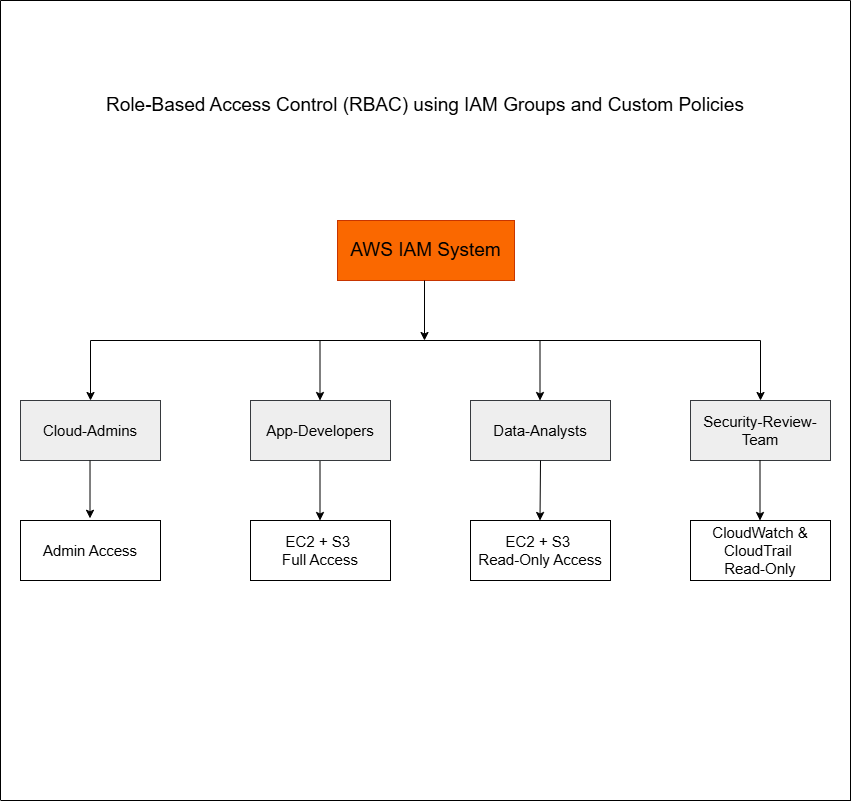

---

# 👥 IAM Groups Implemented

| IAM Group | Purpose |
|---|---|
| Cloud-Admins | Full administrative access to AWS services |
| App-Developers | Access to EC2 and S3 services |
| Data-Analysts | Read-only access to EC2 and S3 |
| Security-Review-Team | Read-only monitoring access to CloudWatch and CloudTrail |

---

# 🔐 IAM Policies Implemented

| Policy Name | Access Level |
|---|---|
| AdministratorAccess | Full AWS Access |
| Developer-EC2-S3-Access | EC2 & S3 access for developers |
| Analyst-ReadOnly-EC2-S3 | Read-only access for analysts |
| Security-Monitoring-ReadOnly | Monitoring access for security team |

---

# 🧠 Key Security Concepts Demonstrated

- Role-Based Access Control (RBAC)
- Principle of Least Privilege
- IAM Groups and Permission Management
- Custom IAM Policies
- Access Restriction & Permission Validation
- Department-Based Access Segregation
- Secure AWS Resource Access

---

# 📸 Project Screenshots

## IAM Groups Overview

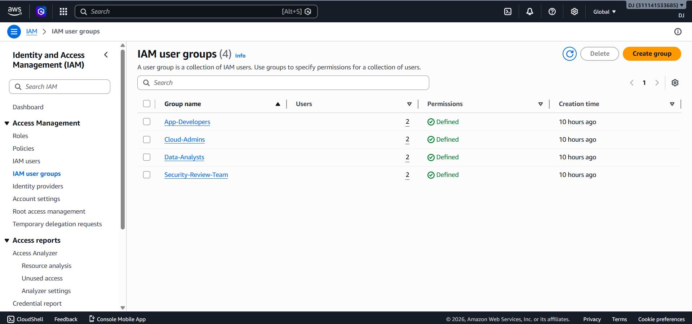

---

## IAM Users Overview

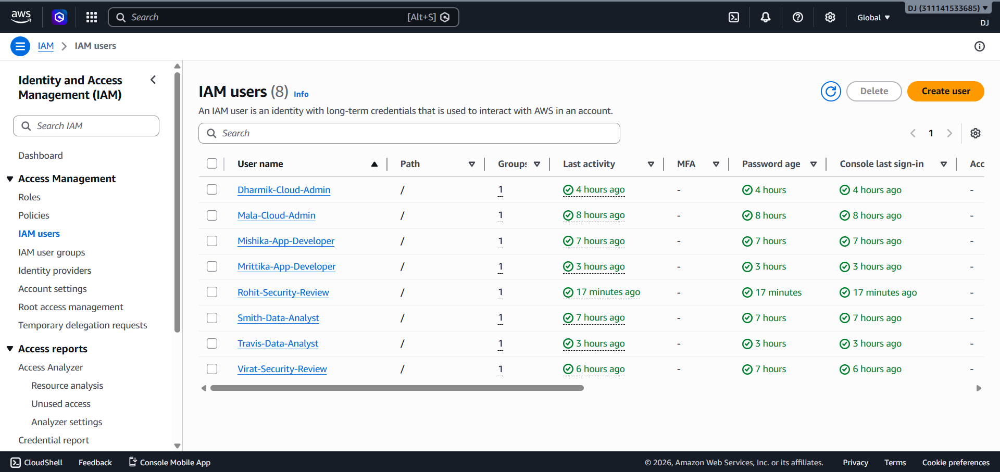

---

## Custom IAM Policies

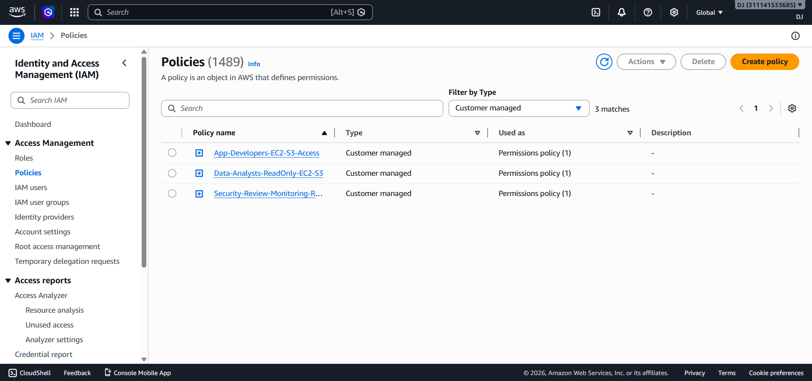

---

## Developer Policy JSON

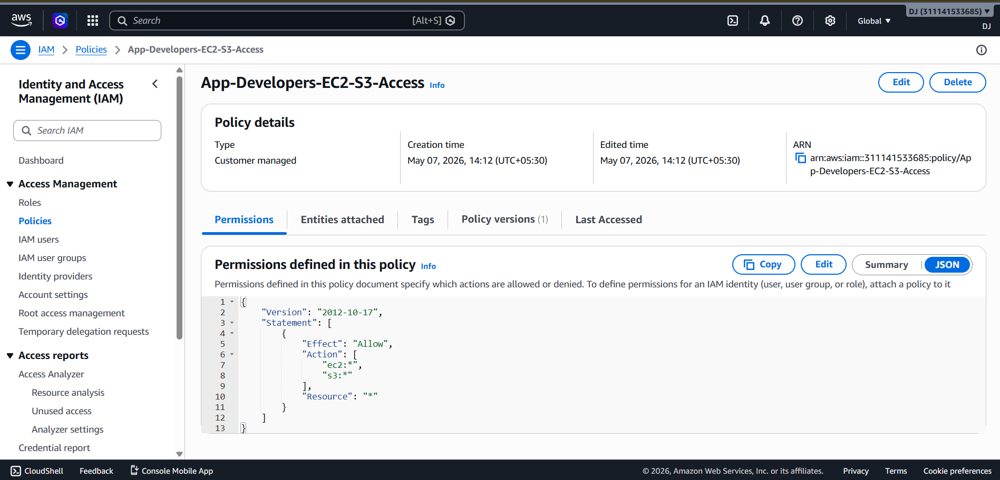

---

## User Group Membership

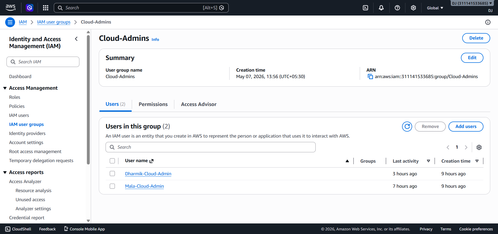

---

## Developer EC2 Launch Success

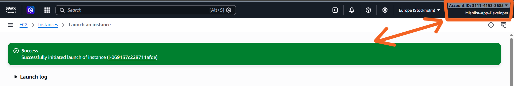

---

## Developer S3 Upload Success

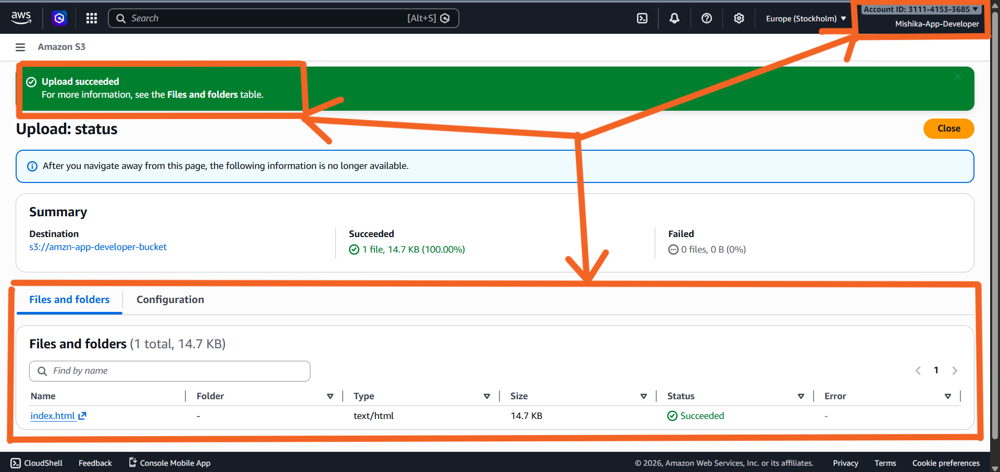

---

## Analyst EC2 Access Denied

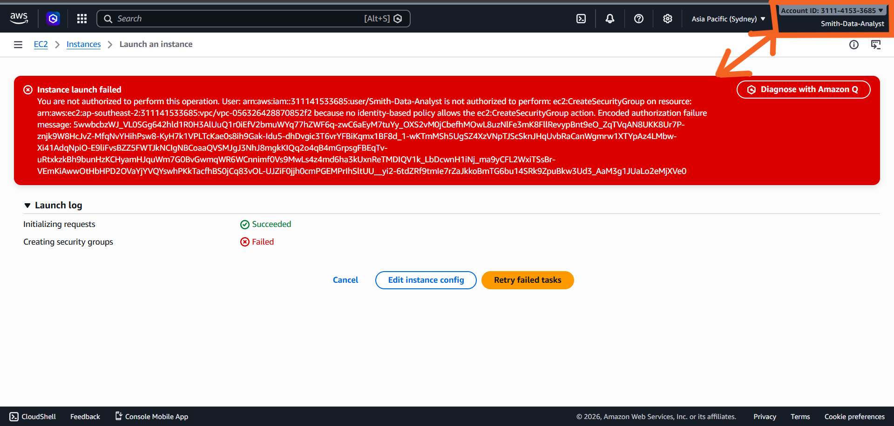

---

## Security Team Monitoring Access

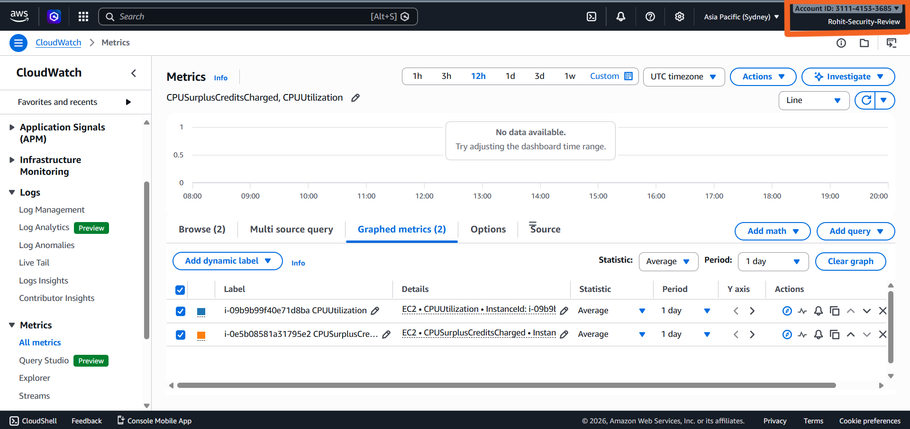

---

## Developer IAM Access Denied

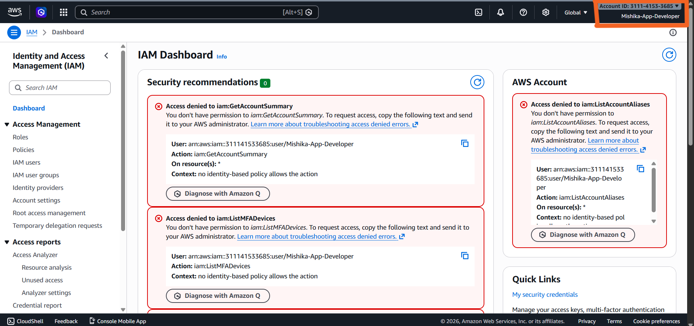

---

# 🔒 Security Best Practices Followed

- Least privilege permissions implemented
- IAM Groups used for scalable permission management
- Custom policies created for department-specific access
- Administrative access restricted to Cloud-Admins only
- Monitoring access separated from operational access
- Access validation tested using real IAM users

---

# 💼 Real-World Use Case

This architecture reflects how organizations manage secure access control across different departments in enterprise cloud environments.

Examples include:
- Developers managing applications
- Analysts reviewing infrastructure data
- Security teams monitoring logs and events
- Administrators managing cloud infrastructure

